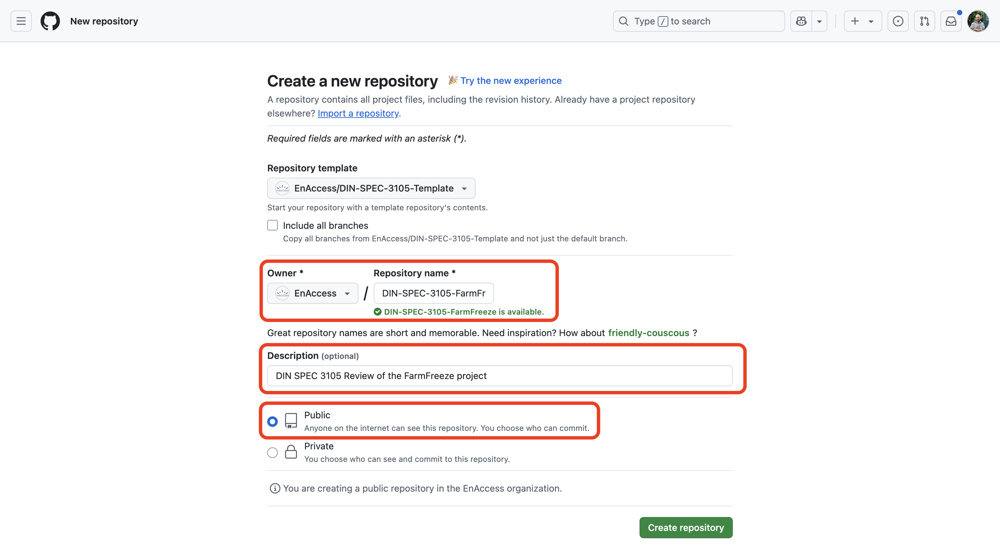

# DIN-SPEC-3105-Template

Use this template repository to create a DIN SPEC 3105 review for the EnAccess CAB.

This `README` contains setup instructions to prepare for a DIN SPEC 3105 review of a project.
Additionally, Github Issue templates are provided to ease the creation of tracking issues (see below).

## Create a new review repository

- Click `Use this template` to start a new DIN SPEC 3105 review repository.

  - For the name as `DIN-SPEC-3105-<PROJECT_NAME>` (for example `DIN-SPEC-3105-<FarmFreeze>`)
  - Choose `EnAccess` as organisation
  - Provide a description (for example `DIN SPEC 3105 Review of the FarmFreeze project`)
  - Choose `Public` as visibility

  

- Adapt the tags of the newly created repository.
  We use the following tags

  - `din3105`: This should be present on all repositories.
  - `din3105-approved`: Add this tag after the DIN SPEC 3105 review has been done and approved.
  - `din3105-reject`: Add this tag after the DIN SPEC 3105 review has been done and rejected.
  - `din3105-in-progress`: Add this tag while the DIN SPEC 3105 review is in progress.

  

- After you went through all the setup instructions in this `README`,
  remove or adapt this `README` to the project.

## Create sub modules

A DIN SPEC 3105 review should always work on a pinned set of repositories.

Please add each repository which is assessed in the review as a [git submodule](https://github.blog/open-source/git/working-with-submodules/).

For each repository:

- Run

  ```sh
  git submodule add https://github.com/example/NameOfProject.git NameOfProject
  ```

- Run

  ```sh
  git add .gitmodules libs/NameOfProject
  git commit -m "Add submodule for `NameOfProject`"
  git push
  ```

> [!NOTE]
> When cloning this repository you also need to pull in the submodules
>
> ```sh
> git clone --recurse-submodules <main-repo-url>
> ```

## Create DIN SPEC 3105 Issues

The progress of the DIN SPEC 3105 review is tracked via Github Issues.
For each of the DIN SPEC 3105 review items create a tracking issue using the `New Issue` button.

- Select the template from the list:

  

- Replace any placeholders in the Issue Template

  

- Using the `Assignee`button, assign reviewers to this issue as relevant.
  Then click `Create`.

  

## Certificate generation

TBD
